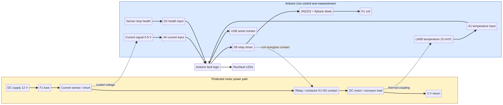

# Motor Fault-Detection & Protection System

A reproducible Arduino/Proteus-style simulation of an industrial DC motor protection relay. The system monitors motor current, winding temperature, and sensor-loop health. When a limit is crossed, the Arduino latches a fault, de-energizes the contactor, and records the event over serial.

> **Project outcome:** The simulated motor is protected against overcurrent, overheating, and invalid sensor feedback. Each scenario has a defined detection signal, root-cause diagnosis, corrective action, and expected serial log.



## System architecture

The power path is deliberately separated from the control path. The motor current passes through a current-sensing element and a normally-open relay contact. The Arduino reads the scaled current signal and LM35 temperature signal, validates the sensor-health loop, and controls the relay driver. A low relay-drive output opens the contactor and removes motor power.

The source diagram is available at [`docs/circuit.mmd`](docs/circuit.mmd), and the Proteus implementation notes are in [`docs/proteus-build-notes.md`](docs/proteus-build-notes.md).

## Protection logic

| Signal | Pin | Engineering interpretation | Trip condition |
|---|---:|---|---:|
| Current sensor | A0 | 0–5 V maps to 0–10 A | `current >= 7.0 A` |
| LM35 temperature | A1 | 10 mV per °C | `temperature >= 75.0 °C` |
| Sensor-health loop | D2 | HIGH means valid loop | LOW means malfunction |
| Contactor driver | D8 | HIGH energizes motor | LOW opens contactor |

The firmware is in [`src/motor_protection.ino`](src/motor_protection.ino). It samples every 100 ms and latches the first fault until reset. The serial format is intentionally machine-readable:

```text
FAULT,t=200ms,cause=OVERCURRENT,current=8.40A,temp=31.5C,action=CONTACTOR_OPEN
```

## Scenario results and root-cause diagnosis

The scenario harness in [`simulation/run_scenarios.py`](simulation/run_scenarios.py) models the same decision order as the Arduino firmware. Run it with `python3 simulation/run_scenarios.py`.

| Scenario | Injected condition | Detection | Response | Root cause and resolution |
|---|---|---|---|---|
| Overcurrent | Current rises from 2.3 A to 8.4 A at 200 ms while temperature remains normal. | A0 exceeds the 7.0 A threshold. | D8 goes LOW; K1 opens; the fault LED turns on; serial logs `OVERCURRENT`. | The motor/load is electrically overloaded or mechanically jammed. Isolate power, inspect the conveyor for obstruction, verify the load rating, and reset only after current returns to the normal range. |
| Overheating | Current remains near 3.1 A while the LM35 rises from 74.4 °C to 76.2 °C at 200 ms. | A1 reaches the 75.0 °C threshold. | D8 goes LOW; K1 opens; the fault LED turns on; serial logs `OVERHEATING`. | The motor is thermally stressed despite normal current. Check ventilation, duty cycle, bearing friction, and ambient temperature. Correct the thermal cause before restart. |
| Sensor malfunction | The sensor-health loop opens at 100 ms while measured values remain plausible. | D2 reads LOW. | D8 goes LOW; K1 opens; the fault LED turns on; serial logs `SENSOR_MALFUNCTION`. | The protection system cannot trust its feedback path. Inspect sensor wiring, ground continuity, connector seating, and sensor supply. Replace or recalibrate the failed sensor, then reset. |

## Reproduce the results

1. Install the Arduino sketch in a Proteus Arduino Uno model and wire the circuit using [`docs/proteus-build-notes.md`](docs/proteus-build-notes.md).
2. Compile the sketch and load its HEX file into the Arduino model.
3. Set the virtual terminal to 9600 baud.
4. Run the Python behavioral check:

   ```bash
   python3 simulation/run_scenarios.py
   ```

5. Run the automated checks, if `pytest` is available:

   ```bash
   python3 -m pytest -q
   ```

6. In Proteus, reproduce each scenario by increasing the current-sensor input, raising the LM35-equivalent voltage, or opening the sensor-health loop. Compare the virtual-terminal event with the expected result table.

## Repository layout

| Path | Contents |
|---|---|
| `src/motor_protection.ino` | Arduino firmware for detection, trip, indication, and serial logging |
| `simulation/run_scenarios.py` | Deterministic software model of the three fault injections |
| `docs/circuit.mmd` | Source for the system circuit diagram |
| `docs/proteus-build-notes.md` | Proteus wiring and setup notes |
| `tests/test_scenarios.py` | Regression tests for threshold and response behavior |
| `assets/circuit.png` | Rendered circuit overview |

## Limitations and next steps

This repository provides a simulation-ready reference design rather than a safety-certified industrial controller. A production implementation would require galvanic isolation, certified overload protection, debounce and filtering, watchdog recovery, fault-history storage, a manual reset circuit, and validation against the selected motor's electrical and thermal limits. The next portfolio iteration could add a Proteus project file, captured virtual-terminal screenshots, and a dashboard that parses the serial event stream into an event timeline.

## License

This project is provided for educational and portfolio use. Add a project-specific license before redistributing it as a public GitHub repository.

## References

[1]: https://docs.arduino.cc/language-reference/en/functions/analog-io/analogRead/ "Arduino analogRead reference"

[2]: https://www.ti.com/lit/ds/symlink/lm35.pdf "Texas Instruments LM35 precision centigrade temperature sensors"
